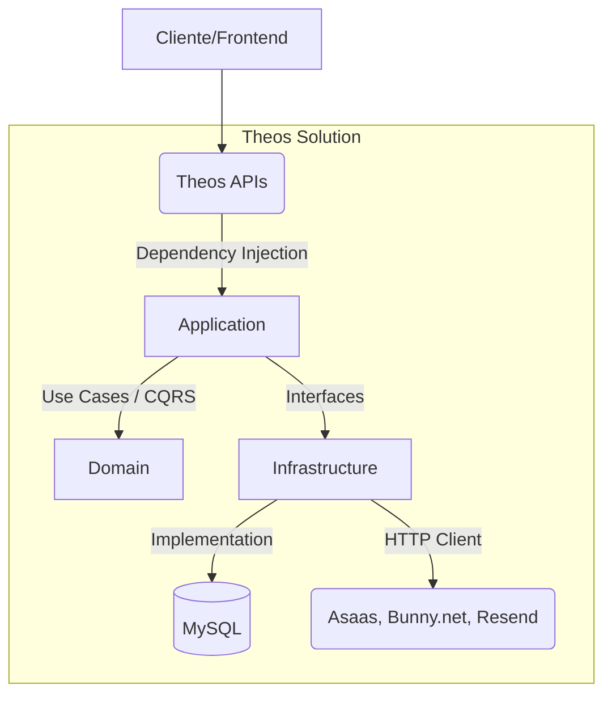

# Theos Backend

## Descrição
O backend da plataforma **Theos** é uma solução distribuída em múltiplos pontos de entrada (APIs) voltada para o gerenciamento e exibição de cursos, aulas, finanças (checkout), suporte e landing pages. A aplicação interage com serviços externos como Asaas (Gateway de Pagamento), Bunny.net (Hospedagem de Vídeos e Arquivos) e Resend (E-mails).

---

## Tecnologias
* **Linguagem / Framework:** C# 12, .NET 8.0
* **Banco de Dados:** MySQL 8.0.36
* **ORM:** Entity Framework Core (Pomelo.EntityFrameworkCore.MySql)
* **Arquitetura / Padrões:** Clean Architecture, DDD, CQRS (MediatR), Repository Pattern
* **Validação:** FluentValidation
* **Autenticação:** JWT (JSON Web Tokens)
* **Real-time:** SignalR
* **Integrações Externas:** Asaas API, Bunny.net API, Resend Email API, Cloudflare Storage

---

## Arquitetura

O projeto adota os princípios da **Clean Architecture** e **DDD**, com separação lógica clara através de múltiplos projetos na Solution. O fluxo de dados segue o padrão CQRS, separando leituras (Queries) de escritas (Commands).



### Estrutura do Projeto

A solução (`Theos.sln`) está dividida nos seguintes projetos principais:

- **`Theos.Domain`**: O núcleo da aplicação. Contém as Entidades (User, Course, Module, Lesson, Purchase, Ticket, etc.), Value Objects e Enums. **Não possui dependências externas.**
- **`Theos.Application`**: Contém as regras de negócio organizadas por *Vertical Slicing* (Feature Folders). É aqui que o MediatR processa `Commands` e `Queries`. Contém as validações (FluentValidation) e as interfaces para a infraestrutura.
- **`Theos.Infrastructure`**: Implementa as interfaces definidas na Application. Responsável por acesso a dados (`TheosDbContext`, EF Core Migrations) e comunicação com APIs externas (AsaasService, BunnyVideoService).
- **`Theos.Api`**: API principal (Portal). Destinada aos alunos e uso geral.
- **`Theos.Admin.Api`**: API administrativa. Destinada a Professores e Administradores para criação e gestão de cursos, aprovação de reembolsos e relatórios financeiros.
- **`Theos.Landing.Api`**: API minimalista para servir dados públicos à Landing Page.

---

## Fluxo da Aplicação (Exemplo CQRS)

1. **Request:** O cliente chama um Endpoint no Controller (ex: `CoursesController`).
2. **Controller:** O Controller mapeia a requisição para um `Command` ou `Query` e envia via `Mediator.Send()`.
3. **Validation (Pipeline):** O `ValidationBehavior` intercepta o request, roda o `FluentValidation` e bloqueia em caso de dados inválidos (retornando HTTP 400 global).
4. **Handler:** Se válido, o Handler correspondente (ex: `UpdateCourseCommandHandler`) é executado na camada Application.
5. **Domain/Infra:** O Handler recupera as entidades do banco através do `ITheosDbContext`, aplica as regras, e salva via `SaveChangesAsync()`.
6. **Response:** O resultado é retornado de volta ao Controller.

---

## Autenticação e Autorização

- **Autenticação:** Utiliza `JwtBearer`. O token é validado a cada requisição restrita usando uma `Issuer` e `SigningKey`.
- **Autorização (RBAC):** Baseado em Roles. A API Administrativa (`Theos.Admin.Api`) faz extenso uso de decoradores como `[Authorize(Roles = "Admin")]` e `[Authorize(Roles = "Teacher")]` no nível de classe e método.

> [!WARNING]
> **Vulnerabilidade Identificada (BOLA/IDOR):** Apesar de verificar a Role (ex: *Teacher*), as ações de escrita (como `UpdateCourseCommand` e `DeleteLessonCommand`) não validam se o *Teacher logado* é de fato o dono daquele curso específico. Isso permite que qualquer professor modifique/exclua aulas de outros professores.

---

## Banco de Dados

- **Tecnologia:** MySQL (via Pomelo Entity Framework Core).
- **Abordagem:** Code-First com Migrations mantidas no projeto `Theos.Infrastructure`.
- **Comportamento (Tracking):** O proxy de Lazy Loading *não* está habilitado (boa prática). O carregamento de entidades relacionadas é feito via `Include` explícito.
- **Auto-Migration:** No momento, a `Admin.Api` roda `context.Database.Migrate()` automaticamente no startup.

---

## Variáveis de Ambiente e Configurações

O projeto depende dos arquivos `appsettings.json` para rodar. No ambiente de Produção, todas as chaves sensíveis devem ser injetadas via Variáveis de Ambiente do Sistema Operacional ou Docker.

### Exemplo Seguro (O que o arquivo deve conter)
```json
{
  "ConnectionStrings": {
    "DefaultConnection": "Server=...;Port=...;Database=theos_bd;Uid=...;Pwd=${DB_PASSWORD};"
  },
  "Jwt": {
    "Key": "${JWT_SECRET_KEY}",
    "Issuer": "apiTheos",
    "Audience": "apiTheosUsers"
  },
  "Asaas": {
    "BaseUrl": "https://api.asaas.com/v3/",
    "ApiKey": "${ASAAS_API_KEY}"
  }
}
```

> [!CAUTION]
> **Risco Crítico Atual:** Da mesma forma que ocorria no Agivys, o projeto Theos possui senhas de Banco de Dados (`Pwd=LikeABoss@1970`) e chaves secretas do JWT (`Key": "jf8C10WiGY...`) "chumbadas" diretamente no código-fonte nos arquivos `appsettings.json` das três APIs.

---

## Tratamento de Erros e Logs

- **Global Exception Handler:** O projeto implementa um `GlobalExceptionMiddleware` elegante.
- Ele captura exceções não tratadas e formata a saída em um JSON padronizado.
- **Prevenção de Vazamento (CWE-209):** O Middleware verifica `env.IsDevelopment()`. Em produção, ele não vaza *Stack Traces* ou SQLs quebrados. Em caso de falha de validação, mapeia corretamente para o status `400 BadRequest`.
- **Logs:** Registros de erros são feitos de forma estruturada via `ILogger`.

---

## Executando Localmente via Docker Compose

1. Na raiz do repositório, garanta que você não tenha serviços ocupando as portas 3306 (Banco) e 5000/5001/5002 (APIs).
2. Configure um arquivo `.env` seguro.
3. Suba o ambiente com:
```bash
docker-compose up -d --build
```
Isso levantará o banco MySQL, as integrações e as APIs simultaneamente.

---

## Problemas Conhecidos e Roadmap de Melhorias

Com base na auditoria arquitetural, abaixo está o plano de ação sugerido:

### 🔴 Prioridade 1 (Crítico) - Imediato
1. **Vazamento de Segredos:** Remover imediatamente `Jwt:Key` e senhas de banco (`DefaultConnection`) dos arquivos `appsettings.json` das três APIs e transferi-los para um `.env`.
2. **Broken Object Level Authorization (BOLA/IDOR):** Corrigir os Handlers administrativos (ex: `DeleteLessonCommandHandler`, `UpdateCourseCommandHandler`) para validar se o usuário autenticado é dono/criador do recurso antes de realizar atualizações ou exclusões.
3. **Exposição de Dados Internos:** O método `CoursesController.GetAll()` na Admin API está com `[AllowAnonymous]` e envia cursos inativos (`IncludeInactive: true`) de forma pública.

### 🟠 Prioridade 2 (Alto) - Próximo Ciclo
1. **Remover Auto-Migration no Startup:** A chamada de `context.Database.Migrate()` dentro do `Program.cs` da `Admin.Api` pode causar travamentos severos e perda de dados (Race Condition) caso duas instâncias da API tentem iniciar ao mesmo tempo em um cenário de escalabilidade. As migrações devem fazer parte da esteira CI/CD.

### 🟡 Prioridade 3 (Médio) - Roadmap
1. **Isolamento de Cache:** Adicionar estratégias de Redis para endpoints públicos altamente consumidos, como a lista de cursos da `Landing.Api`.

### 🔵 Prioridade 4 (Baixo) - Manutenção
1. **Testes Automatizados:** Não foram detectados projetos de testes maduros (XUnit/NUnit) validando o Core do Domínio ou fluxos complexos como Checkouts Financeiros.
