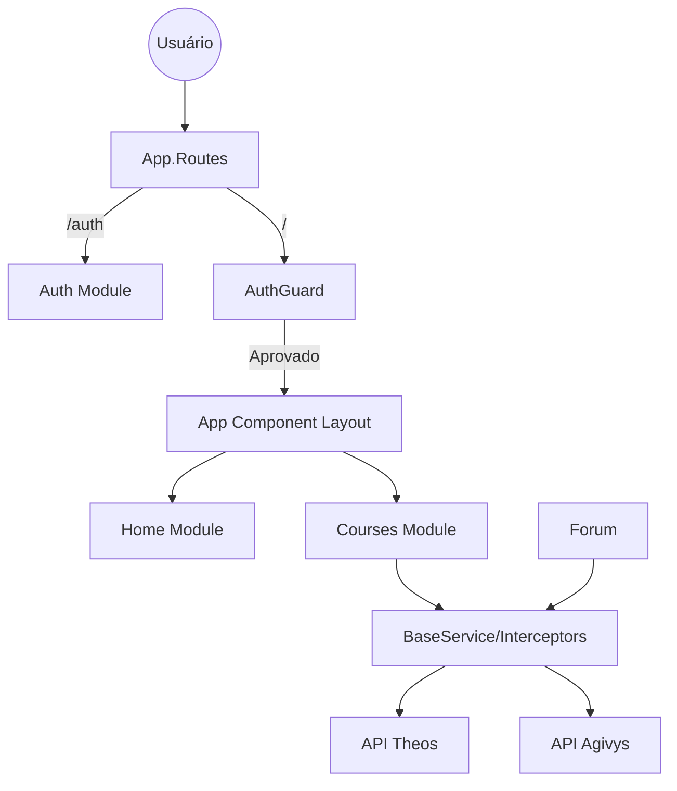
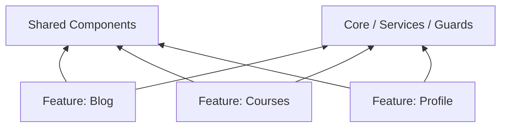

# POP - Portal do Professor Theos (Frontend) - Documentação Oficial

Bem-vindo à documentação oficial do frontend do **POP - Portal do Professor Theos**. Este documento contém a visão geral completa da arquitetura, fluxo funcional, organização estrutural e guia de implementação para desenvolvedores e agentes de IA, cobrindo todo o ciclo de vida do projeto.

---

## Índice
1. [Visão Geral](#1-visão-geral)
2. [Arquitetura](#2-arquitetura)
3. [Stack Técnica](#3-stack-técnica)
4. [Estrutura de Pastas](#4-estrutura-de-pastas)
5. [Páginas da Aplicação](#5-páginas-da-aplicação)
6. [Componentes Compartilhados](#6-componentes-compartilhados)
7. [Fluxos Funcionais](#7-fluxos-funcionais)
8. [Camada de Dados](#8-camada-de-dados)
9. [Regras de Negócio](#9-regras-de-negócio)
10. [Dependências entre Módulos](#10-dependências-entre-módulos)
11. [Configuração do Ambiente](#11-configuração-do-ambiente)
12. [Convenções do Projeto](#12-convenções-do-projeto)
13. [Pontos de Atenção](#13-pontos-de-atenção)
14. [Contexto para Agentes de IA](#14-contexto-para-agentes-de-ia)

---

## 1. Visão Geral

- **Objetivo do Projeto:** O POP (Portal do Professor) é uma plataforma interativa para professores da Theos gerenciarem turmas, cursos e interagirem com os recursos acadêmicos.
- **Público-alvo:** Professores e instrutores da plataforma Theos.
- **Principais Funcionalidades:**
  - Login com validação estrita de permissões (Exige perfil `Teacher`).
  - Módulo de Cursos (ambiente acadêmico preparado para gestão).
  - Gestão de perfil e dados cadastrais.
- **Tecnologias Base:** Angular 18 com Server-Side Rendering (SSR) suportado por Node.js/Express.

---

## 2. Arquitetura

A aplicação foi projetada no padrão modularizado (Feature-based Modular Architecture) com forte separação de responsabilidades (SoC).
- **Fluxo Geral:** Usuário acessa o app $\rightarrow$ Guardião de Rotas (AuthGuard) verifica autenticação $\rightarrow$ Carregamento da Rota Lazy (Ex: Courses) $\rightarrow$ Consumo de APIs via interceptors e BaseService $\rightarrow$ Exibição na UI (Bootstrap 5).
- **SSR (Server-Side Rendering):** Utilizado via `@angular/ssr` e Express para otimização de SEO e tempo de carregamento (First Contentful Paint).
- **Estratégias de Reutilização:** Módulos independentes orquestram seus próprios componentes locais, mas dependem do módulo genérico `shared/` para pão-de-forma (breadcrumbs), menus, alertas e UI.
- **Padrões:**
  - *Smart/Dumb Components:* A maioria das páginas em `features/modules/.../pages` atua como "Smart", lidando com serviços, estados e fluxos de dados, enquanto itens de `shared/components` são orientados puramente por `@Input()` e `@Output()`.

### Arquitetura em Diagrama


---

## 3. Stack Técnica

- **Framework Core:** Angular v18.2.0 (SPA)
- **SSR (Server-Side Rendering):** `@angular/ssr`, Express e Node.js
- **UI Framework & Estilização:** 
  - Bootstrap v5.3.8
  - Bootstrap Icons e FontAwesome 7
  - SCSS/SASS para estilizadores modulares e customização (`custom-theme/`).
- **Gerenciamento de Estado:** `@ngrx/store` (v18.1.1)
- **Roteamento:** Angular Router (Lazy Loading)
- **Websockets / Realtime:** `@microsoft/signalr` v10.0 (Serviços em tempo real e fórum/notificações)
- **Utilitários Adicionais:** `jspdf` (para exportação/certificados), `rxjs` (reatividade).
- **Build e Ferramentas:** Angular CLI, Node 18+, Karma/Jasmine para testes (Configuração base gerada).

---

## 4. Estrutura de Pastas

A organização segue a divisão lógica recomendada pela equipe do Angular:

- **`src/app/core/`**: O "coração" da aplicação. Possui tudo o que é carregado uma única vez na inicialização (Singleton services).
  - **`auth/`**: Gerencia tokens e sessões.
  - **`guards/`**: Regras de proteção de rotas (ex: `auth.guard.ts`).
  - **`interceptors/`**: Tratamento genérico de HTTP (erros, injeção de tokens).
  - **`services/`**: Serviços transversais (ex: `base.service.ts`, `signalr.service.ts`).
- **`src/app/features/`**: Funcionalidades agrupadas por contexto de negócios (Domain Driven).
  - **`auth/`**: Fluxo de autenticação, login, registro, troca de senha.
  - **`modules/`**:
    - `courses`: Funcionalidades de gestão de cursos para o professor.
    - `home`: Dashboards do usuário e consumo de avisos.
- **`src/app/shared/`**: Recursos compartilhados por toda a aplicação (sem injeção de estado complexo).
  - `components`: `toast`, `breadcrumb`, menu lateral.
- **`custom-theme/`**: Configurações globais de tokens SCSS (`theme.scss`).

---

## 5. Páginas da Aplicação

### Módulo de Autenticação (`/auth`)
- **Login (`/auth/login`):** Tela inicial de acesso. Chama a API de login e delega o token ao `AuthUtil`.
- **Register (`/auth/register`):** Formulário de inscrição.
- **Recovery Password (`/auth/recovery-password`):** Recuperação via email.
- **Update Password (`/auth/update-password`):** Tela ativada via deep link para reset de credencial.

### Módulo Home (`/home`)
- **Dashboard (`/home`):** Página principal pós-login. Exibe métricas, progresso e notícias. Usa o `HomeDashboardComponent`.
- **News Detail (`/news-detail/:id`):** Componente para exibir conteúdo detalhado da plataforma de notícias ou avisos.

### Módulo de Cursos (`/courses`)
- **Home de Cursos (`/courses`):** Ambiente inicial preparado para gestão de cursos e turmas do professor.

### Outros Módulos
- **Blog (`/blog`)**
- **Perfil (`/profile`)**
- **Configurações (`/settings`)**
- **Suporte (`/support`)**

---

## 6. Componentes Compartilhados

Componentes mantidos na pasta `src/app/shared/components/`:
- **`BreadcrumbComponent`:** Lê as rotas ativas ou recebe um array via `@Input()` para montar a navegação de retorno.
- **`ToastComponent`:** Mostra mensagens flutuantes e efémeras para sucesso/erro. Operado centralmente via `ToastService` em `core/services/toast.service.ts`.
- **`MenuSideComponent`:** Barra de navegação responsiva esquerda. Construída recebendo os estados de permissão.

---

## 7. Fluxos Funcionais

### Fluxo de Autenticação e Sessão
1. O usuário entra em `/auth/login`.
2. Envia credenciais. A API valida e devolve um token JWT.
3. O `AuthUtil` salva o JWT em **cookies/localStorage**.
4. O usuário é redirecionado para `/`.
5. O `AuthGuardService` avalia se existe token válido; se não, bloqueia e redireciona ao `/auth`.
6. O `BaseService` injeta o token (`GetAuthHeaderJson`) automaticamente em todas as chamadas.

### Gestão de Conteúdo (Cursos)
1. Professores gerenciam a base de conhecimento e estrutura dos cursos.
2. Interações com alunos e acompanhamento de progresso de turmas.

---

## 8. Camada de Dados

- **Base Service (`core/services/base.service.ts`):** Classe abstrata fundamental. Todos os serviços assíncronos (`ForumService`, `HomeService`, etc.) herdam dela. Ela lida com a montagem padronizada de *Headers* (JSON, URL Encoded, Tokens) através das URLs globais (Theos, Agivys, Auth).
- **Interceptors:** `error-interceptor.ts` escuta requisições falhas de modo global. Falhas de Token (`401`) limpam o cookie e despacham o usuário para o login.
- **Gerenciamento State Local:** Uso primário do paradigma de Promessas (`async/await`) somado a `firstValueFrom` encapsulando fluxos RxJS.
- **Gerenciamento State Global:** A infraestrutura prevê o NGRX Store (`@ngrx/store`), ideal para cenários altamente reativos (como dados de notificação recebidos via SignalR).

---

## 9. Regras de Negócio

- **Autenticação:** O sistema desloga automaticamente em retornos `401 Unauthorized`.
- **Cursos e Autoria:**
  - O professor visualiza apenas os módulos e cursos vinculados a sua propriedade ou docência.
- **Navegação (Lazy Loading):** Partes do sistema só são carregadas em RAM e via rede se o usuário efetivamente clicar no link do menu, economizando tráfego de dados.

---

## 10. Dependências entre Módulos

O projeto adota uma arquitetura acoplada ao Core.
- O Módulo `Auth` não depende de nenhuma feature.
- Todos os módulos (`courses`, `blog`, `profile`, `settings`, `support`) dependem estritamente do `CoreModule` e de `Shared`. Não há dependência cruzada (*circular dependency*) entre módulos.

### Diagrama de Dependências


---

## 11. Configuração do Ambiente

O projeto Angular 18 é iniciado primariamente via CLI.
- **Arquivos de Ambiente (`core/environments/`):**
  - `environment.ts`: Contém configurações locais de APIs (`apiAgivysUrl`, `apiTheosUrl`).
  - `environment.prod.ts`: URLs produtivas substituídas no momento de build.
- **Scripts do `package.json`:**
  - `npm start`: Inicia o servidor local CSR (Client-Side) (`ng serve`).
  - `npm run watch`: Modo contínuo de build para desenvolvimento SSR.
  - `npm run serve:ssr:portal-popt`: Executa a compilação universal no lado do servidor via Node.
- **Processo de Deploy:** Envolve o build estático somado ao bundle de servidor SSR (`dist/portal-popt/server/server.mjs`), que deve ser invocado via host PM2 ou contêiner (Dockerfile incluído no root).

---

## 12. Convenções do Projeto

- **Nomenclatura (Arquivos):** `[nome-do-componente].component.ts`, `[contexto].service.ts`.
- **SCSS Modular:** Todo componente possui seu próprio arquivo SCSS encapsulado (ViewEncapsulation.Emulated). Estilos globais ficam restritos ao `custom-theme`.
- **Promessas em Serviços:** Embora Angular utilize muito RxJS de fábrica, o padrão do projeto em serviços (ex: `ForumService`) é o envelopamento de Observables em Promises: `await firstValueFrom(...)`. O objetivo é criar código imperativo mais legível em handlers de UI.
- **Componentes Standalone:** O projeto adere ao uso de componentes Standalone (`standalone: true`), descartando na maioria das pastas o uso dos antigos `NgModules`.

---

## 13. Pontos de Atenção

- **Tratamento de Tokens DTO:** Na conversão de DTOs nas respostas (como visto no `forum.service`), a flexibilidade nos nomes dos JSON properties da API (ex: `replyCount` vs `repliesCount`) requer validações defensivas constantes no frontend para evitar erros de renderização nula (`|| 0`).
- **SignalR:** Certifique-se de fechar conexões `HubConnection` no `ngOnDestroy` de componentes que dependam do `SignalrService`, a fim de evitar vazamento de memória.
- **Server Side Rendering (SSR):** Não utilizar artefatos que dependem puramente da API do navegador (ex: `window`, `document`) fora do block condicional `isPlatformBrowser`. Isso causará falhas severas de construção pelo SSR Node.js.

---

## 14. Contexto para Agentes de IA

Este guia é feito exclusivamente para Assistentes Autônomos (LLMs) operarem nesta base de código sem a necessidade de varredura prévia de toda a árvore de diretórios.

### Checklist Antes de Alterar Código
1. **Analise o Diretório Correto:** As páginas sempre residem em `src/app/features/modules/[nome-do-modulo]/pages`. Os serviços relacionados ficam em `.../[nome-do-modulo]/services`.
2. **Entenda o Serviço Base:** Todos os chamados de API devem passar por um Service do módulo correspondente. Este service **deve** estender a classe `BaseService` do `core`. Nunca injete `HttpClient` puro num componente de visualização.
3. **Respeite o CSS:** Evite classes utilitárias *ad-hoc* excessivas se não houver no Bootstrap. Respeite os blocos encapsulados SCSS do componente.

### Regras de Ouro da Implementação
- **Chamadas de API:** Devem utilizar `async / await` convertendo RxJS (`firstValueFrom`) dentro do serviço, devolvendo DTOs ou Models puros para os componentes.
- **Autorização/Status:** Checagens de regras de negócio de visualização (botões que devem sumir, cards filtrados) devem ser resolvidas primariamente por *getters* ou métodos públicos no arquivo `.ts` do componente. Não inclua muita lógica na interpolação `.html` (`*ngIf="longa regra && blabla"`).
- **Standalone:** O projeto usa o Angular moderno. Todo novo componente criado (`ng g c ...`) deve ser standalone e gerenciar seus próprios *imports* de `CommonModule`, `FormsModule`, e `RouterModule`.

### Onde implementar Novas Features?
- **Novas páginas de contexto existente:** Crie dentro da sub-pasta `pages/` do módulo respectivo e cadastre na variável `routes` (`.routes.ts`) do próprio módulo.
- **Novos módulos isolados:** Crie a pasta em `src/app/features/modules/`, prepare um `.routes.ts` com loadChildren sendo invocado do `src/app/app.routes.ts`.


## 15. Padrão Ouro de Design (UI/UX Guidelines)

Para manter a interface com um aspecto visual consistente, moderno e de altíssima qualidade (o "Padrão Ouro"), todo novo componente e principalmente **Modais** devem seguir rigorosamente a arquitetura de design estruturada abaixo:

### 15.1 Modais: Estrutura Premium (Padrão Ouro)
Todo modal criado na aplicação deve possuir a seguinte estrutura de cabeçalho (`modal-header`). Esta estrutura inclui um fundo escuro elegante, bordas arredondadas e um ícone em marca d'água posicionado ao fundo, além de um círculo de destaque para o ícone principal.

**Código Template Padrão:**
```html
<div class="modal fade" id="exemploModal" tabindex="-1">
  <div class="modal-dialog modal-dialog-centered"> <!-- Use modal-md, modal-lg ou modal-xl conforme necessidade -->
    <div class="modal-content rounded-4 border-0 shadow-lg overflow-hidden d-flex flex-column">
      
      <!-- Premium Header -->
      <div class="modal-header bg-dark border-bottom-0 pb-3 pt-4 px-4 rounded-top-4 position-relative overflow-hidden flex-shrink-0">
        <!-- Ícone Marca D'água (Fundo) -->
        <div class="position-absolute top-0 end-0 p-3 opacity-25">
          <i class="fas fa-[ICONE] text-white" style="font-size: 8rem; transform: translate(20%, -30%);"></i>
        </div>
        
        <!-- Conteúdo do Header (Ícone Destaque + Títulos) -->
        <div class="d-flex align-items-center gap-3">
          <div class="bg-[COR] bg-opacity-10 text-[COR] rounded-circle d-flex align-items-center justify-content-center shadow-sm flex-shrink-0" style="width: 48px; height: 48px;">
            <i class="fas fa-[ICONE] fs-5"></i>
          </div>
          <div>
            <h5 class="modal-title fw-bolder text-white mb-0 fs-5">Título Principal</h5>
            <small class="text-white-50 fw-medium d-block" style="max-width: 300px;">Subtítulo ou instrução breve</small>
          </div>
        </div>
        
        <!-- Botão Fechar -->
        <button type="button" class="btn-close position-absolute top-0 end-0 mt-4 me-4" data-bs-dismiss="modal" aria-label="Close"></button>
      </div>

      <!-- Corpo do Modal -->
      <div class="modal-body p-4 bg-secondary bg-opacity-10 custom-scrollbar overflow-auto">
        <!-- Conteúdo do Formulário / Lista -->
      </div>
      
    </div>
  </div>
</div>
```

**Regras Essenciais para Modais:**
1. **Atributos de Layout:** Sempre mantenha `position-relative overflow-hidden flex-shrink-0` no `modal-header` para garantir que o ícone de marca d'água grande não "vaze" para fora da caixa do modal.
2. **Posicionamento da Marca D'água:** Use `translate(20%, -30%)` em fontes de tamanho `8rem` posicionado via `top-0 end-0`. Evite usar modificadores CSS como `pointer-events: none` ou `z-index` desnecessariamente, pois podem interferir na renderização de versões específicas do FontAwesome dependendo do motor do navegador.
3. **Cores Semânticas (`[COR]`):**
   - **Módulos:** `primary` (`fa-layer-group`)
   - **Aulas:** `danger` (`fa-play-circle`)
   - **Cursos/Educação:** `success` (`fa-graduation-cap`)
   - **Domínios/Web:** `info` (`fa-globe`)
   - **Professores/Pessoas:** `primary` ou coloração personalizada (`fa-chalkboard-teacher`)
   - **Exclusão/Avisos:** `warning` ou `danger` (`fa-exclamation-triangle`)
4. **Scroll e Altura:** Para modais muito grandes (como o Novo Curso em `modal-xl`), limite a altura (`style="height: 90vh;"`) e aplique `overflow-auto` no `modal-body` mantendo a estrutura de flex container, evitando assim que o modal inteiro cause scroll na tela principal.
5. **Harmonia Visual:** Empregue intensamente transparências do Bootstrap (`bg-opacity-10`) combinadas com cores sólidas nos textos/ícones internos para um aspecto visual refinado (Glassmorphism sutil).

---
*Documentação mantida e atualizada para o ecossistema Portal do Professor Theos (POP).*
